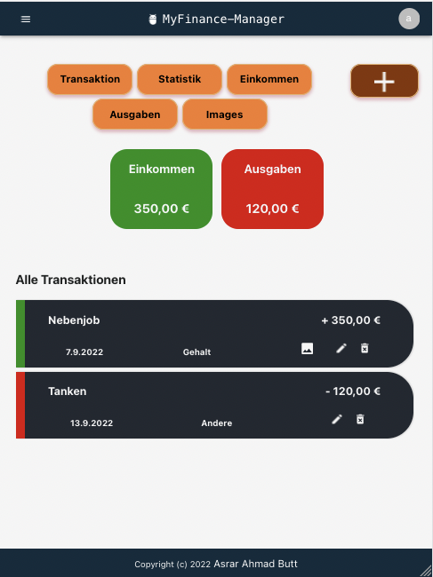

# MyFinance-Manager

MyFinance-Manager ist eine App zur Erfassung von Einnahmen und Ausgaben.
Die Transaktionen können ein Image z.b. einen Rechnungsbeleg enthalten.
Die Zahlungsströme werden in Kategorien gruppiert und grafisch dargestellt. Die persönliche Budgetkontrolle ist
wichtiger den je.
Dadurch behalten Sie einen besseren Überblick und können Einnahmen und Ausgaben am Ende des Monats miteinander
vergleichen und gezielt auswerten.

## Funktionalitäten Übersicht

- Login und Register
- Hinzufügen, Löschen, überarbeiten der Transaktionen und Bilder
- Alle Ausgaben in einer Liste
- Alle Einnahme in einer Liste
- Grafische Gegenüberstellung der einzelnen Einnahmen und Ausgaben

Frontend:

Backend:

# Screenshots

### zum Testen:

#### Email: peter@gmail.com

#### password: Peter123

